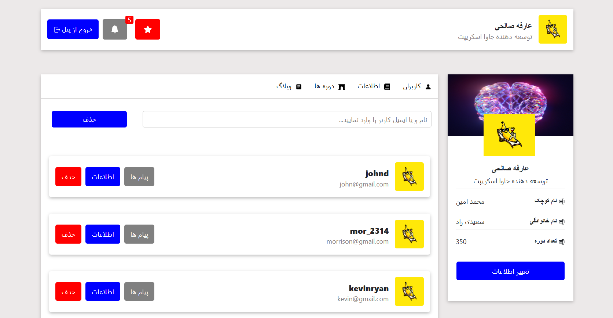

# 📊 Redux CMS Dashboard

A simple Content Management System (CMS) dashboard built with **React** and **Redux Toolkit** to demonstrate state management, CRUD operations, and scalable application architecture.

This project focuses on implementing a clean Redux architecture using Redux Toolkit while interacting with a fake REST API powered by JSON Server.

---

<p align="center">
  
</p>

---

## ✨ Features

- 📄 Display users from API
- ➕ Get  users
- 🗑 Delete users
- ⚡ Global State Management with Redux Toolkit
- 🔄 Async CRUD operations using createAsyncThunk
- 🌐 Fake REST API 
- 📱 Clean and simple dashboard layout

---


# 🛠 Tech Stack

- React
- Redux Toolkit
- React Redux
- CSS

---


# 🧠 Project Highlights

This project demonstrates:

- Redux Toolkit architecture
- Global state management
- Async actions with createAsyncThunk
- CRUD operations
- REST API integration
- Reducers & ExtraReducers
- Loading and Error state handling
- Component-based architecture
- Clean folder structure

---

# 📂 Folder Structure

```text
src
│
├── components
├── pages
├── redux
│   ├── slices
│   └── store.js
├── services
├── assets
├── db.json
└── App.jsx
```

---

# 📚 What I Practiced

- Redux Toolkit
- createSlice
- createAsyncThunk
- React Redux
- Async State Management
- REST API Integration
- CRUD Operations
- Component Reusability
- Project Structure


